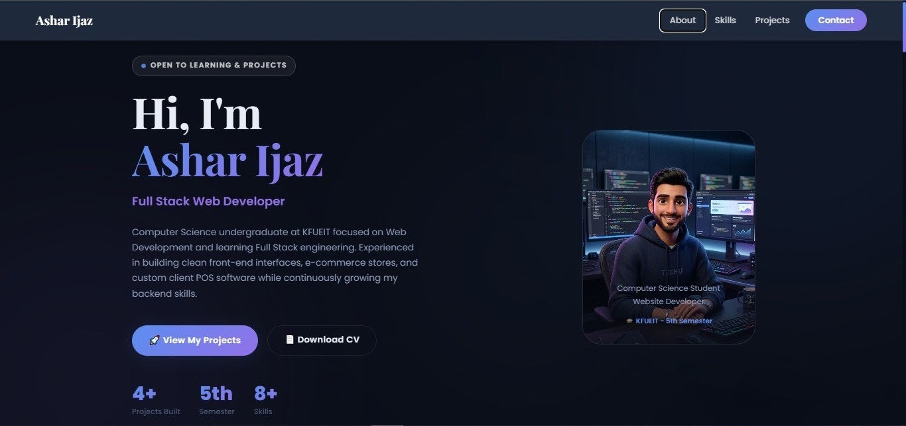

# 🚀 Ashar Ijaz — Personal Portfolio

Welcome to the official developer portfolio repository of **Ashar Ijaz**, Computer Science Undergraduate at Khwaja Fareed University of Engineering & Information Technology (KFUEIT).

---

## 🌟 About Me
- 🎓 **Education:** BS Computer Science (5th Semester) @ KFUEIT
- 💻 **Focus:** Front-end Web Development, Desktop POS Applications in Java, E-commerce Stores
- ✉️ **Email:** [asharijaz.cs@gmail.com](mailto:asharijaz.cs@gmail.com)
- 💼 **LinkedIn:** [Ashar Ijaz](https://www.linkedin.com/in/ashar-ijaz-672505399)
- 🐙 **GitHub:** [@asharijaz328-cmd](https://github.com/asharijaz328-cmd)

---

## 🛠️ Tech Stack & Skills

* **Front-end Web:** HTML5, CSS3, JavaScript (ES6+), Bootstrap, Responsive UI/UX
* **Desktop Software:** Java, Java Swing, SQLite
* **Programming Languages:** Java, C++ (Basics), Python, OOP, DSA
* **Databases:** MySQL, SQL, SQLite
* **Tools & Platforms:** Git & GitHub, Shopify Store Setup, VS Code, AI-Assisted Workflows

---

## 📌 Featured Projects

### 1. ⚡ Azam Traders POS
- **Tech Stack:** `Java` · `Java Swing` · `SQLite`
- **Description:** Desktop POS software built for a battery store, featuring stock inventory management, warranty tracking & claims, sales receipts, and analytics.
- **Links:** [LinkedIn Post](https://www.linkedin.com/posts/activity-7482032517353578497-9eQ_?utm_source=share&utm_medium=member_android&rcm=ACoAAGHI8XYBgzudhwqD7bnmJvQ_SeiEhUXBsGA) · [GitHub Repository](https://github.com/asharijaz328-cmd/Azam-Traders)

### 2. 🛒 Smart POS System
- **Tech Stack:** `Java` · `SQLite` · `Desktop GUI`
- **Description:** Point of Sale software for retail store inventory management, billing, and customer record tracking.
- **Links:** [LinkedIn Profile](https://www.linkedin.com/in/ashar-ijaz-672505399) · [GitHub Repository](https://github.com/asharijaz328-cmd/CrownMill-POS)

### 3. 🛍️ E-commerce Store
- **Tech Stack:** `HTML5` · `CSS3` · `JavaScript` · `Firebase`
- **Description:** Modern online store with product catalog, dynamic cart, real-time database, and interactive admin panel.
- **Links:** [Live Store](https://crownmill.pk) · [GitHub Repository](https://github.com/asharijaz328-cmd/crown-mill-store)

### 4. 🌐 Portfolio Website
- **Tech Stack:** `HTML5` · `CSS3` · `JavaScript`
- **Description:** Dark glassmorphism portfolio website with smooth scroll animations, interactive cards, and working contact form.
- **Links:** [Live Website](https://asharijaz328-cmd.github.io/Portfolio/) · [GitHub Repository](https://github.com/asharijaz328-cmd/Portfolio)

---

## 📬 Contact & Connect

If you'd like to collaborate on a project or discuss job opportunities, feel free to reach out via [Email](mailto:asharijaz.cs@gmail.com) or connect on [LinkedIn](https://www.linkedin.com/in/ashar-ijaz-672505399).
